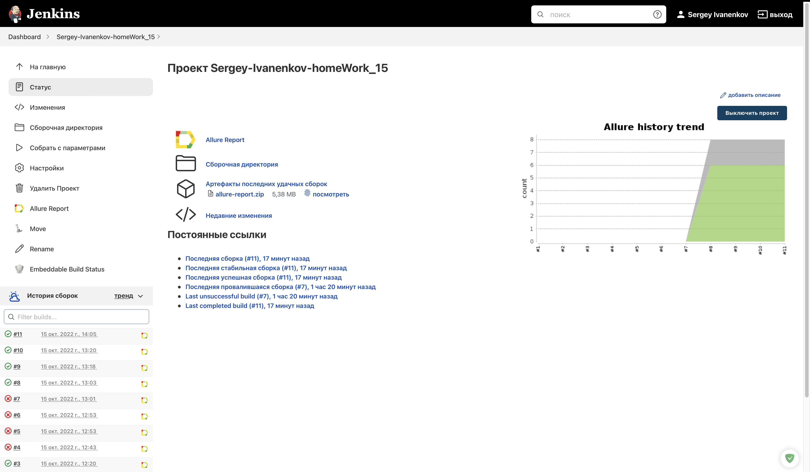
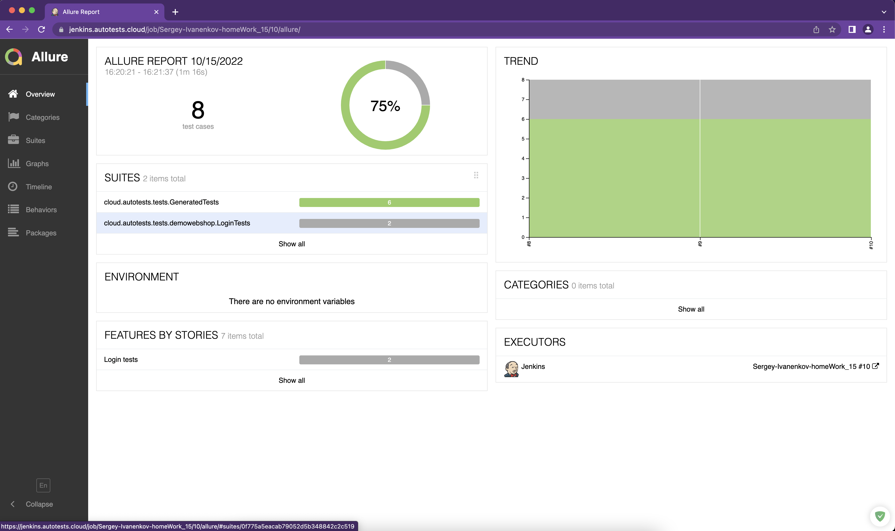
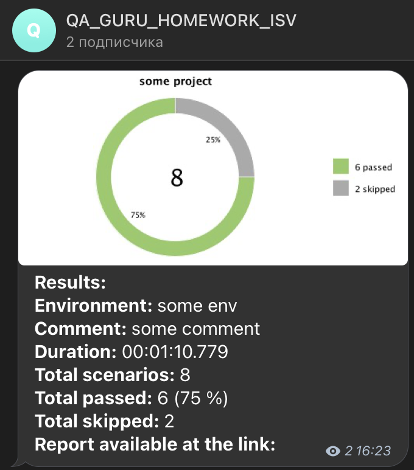

# Проект по автоматизации тестирования JavaRush

## :pushpin: Содержание:

- [Технологии и инструменты](#rocket-технологии-и-инструменты)
- [Реализованные проверки](#tests-реализованные-проверки)
- [Сборка в Jenkins](#-jenkins-job)
- [Запуск из терминала](#earth_africa-Запуск-тестов-из-терминала)
- [Allure отчет](#-отчет-в-allure-report)
- [Отчет в Telegram](#-уведомление-в-telegram-при-помощи-бота)
- [Видео примеры прохождения тестов](#-примеры-видео-о-прохождении-тестов)


## :rocket: Технологии и инструменты

<p align="center">
<a href="https://www.jetbrains.com/idea/"></a>
<a href="https://www.java.com/"></a>
<a href="https://github.com/"></a>
<a href="https://junit.org/junit5/"></a>
<a href="https://gradle.org/"></a>
<a href="https://selenide.org/"></a>
<a href="https://aerokube.com/selenoid/"></a>
<a href="https://github.com/allure-framework/allure2"></a>
<a href="https://www.jenkins.io/"></a>
</p>

## :tests: Реализованные-проверки

- ✓ Проверка переходов по категориям в хедере.
- ✓ Проверка лога консоли на наличие ошибок.

## </a> Jenkins job

<a target="_blank" href="https://jenkins.autotests.cloud/job/Sergey-Ivanenkov-homeWork_15/">Сборка в Jenkins</a>
<p align="center">
<a href="https://jenkins.autotests.cloud/job/Sergey-Ivanenkov-homeWork_15/"></a>
</p>

### Параметры сборки в Jenkins:

* BROWSER_NAME (default chrome)
* BROWSER_VERSION (default 100.0)
* BROWSER_SIZE (default 1920x1080)
* REMOTE_DRIVER_URL (default selenoid.autotests.cloud)
* THREADS (default 1)

### :computer: Запуск тестов из терминала

```bash
gradle clean test
```

### Удаленный запуск:

```bash
clean
test
-Dbrowser=${BROWSER_NAME}
-DbrowserVersion=${BROWSER_VERSION}
-DbrowserSize=${BROWSER_SIZE}
-DremoteDriverUrl=https://user1:1234@${REMOTE_DRIVER_URL}/wd/hub/
-DvideoStorage=https://${REMOTE_DRIVER_URL}/video/
-Dthreads=${THREADS}
```

## </a> Отчет в <a target="_blank" href="https://jenkins.autotests.cloud/job/Sergey-Ivanenkov-homeWork_15/10/allure/">Allure report</a>

### Основное окно

<p align="center">

</p>


## </a> Уведомление в Telegram при помощи бота

<p align="center">

</p>

### </a> Примеры видео о прохождении тестов

<p align="center">
  
</p>